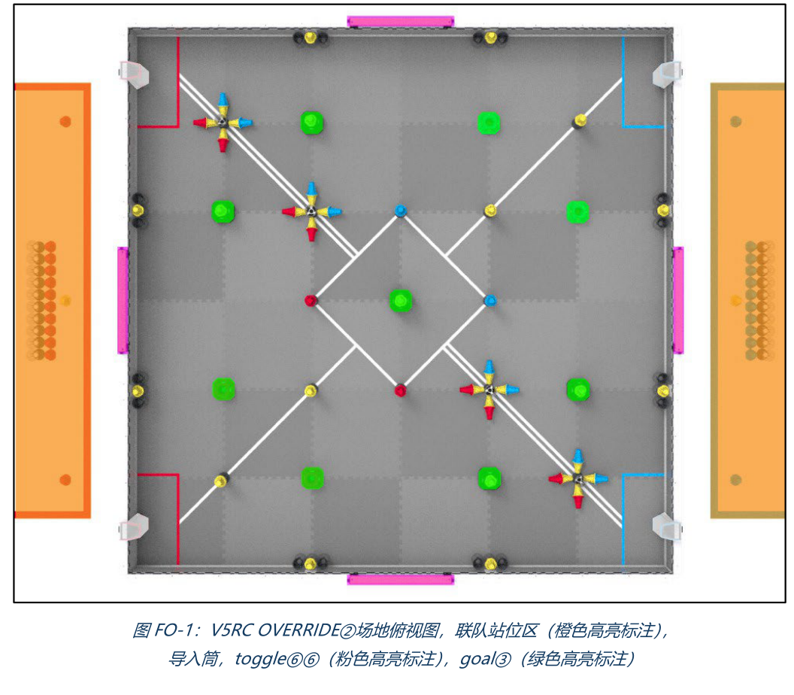
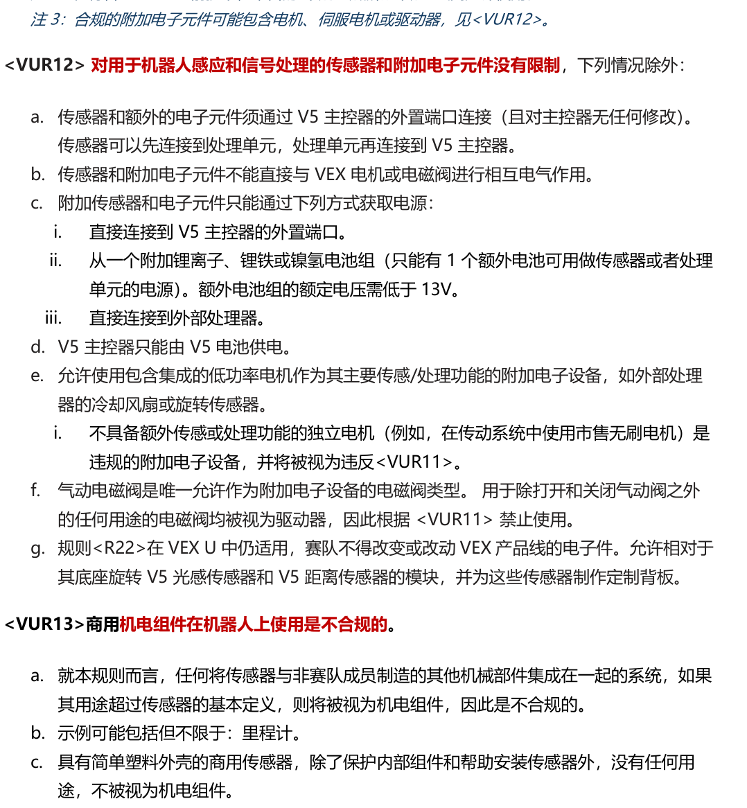
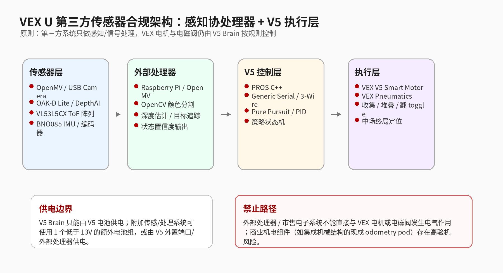
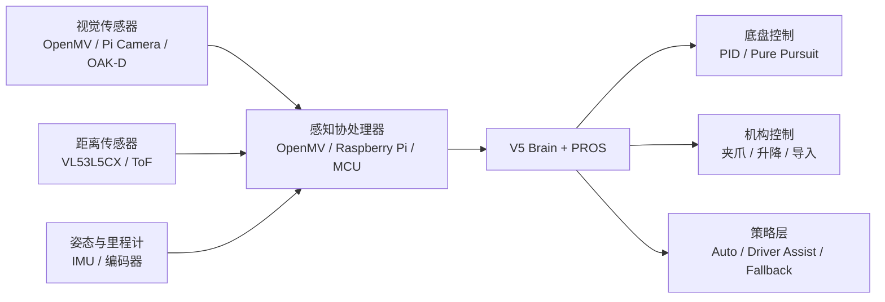
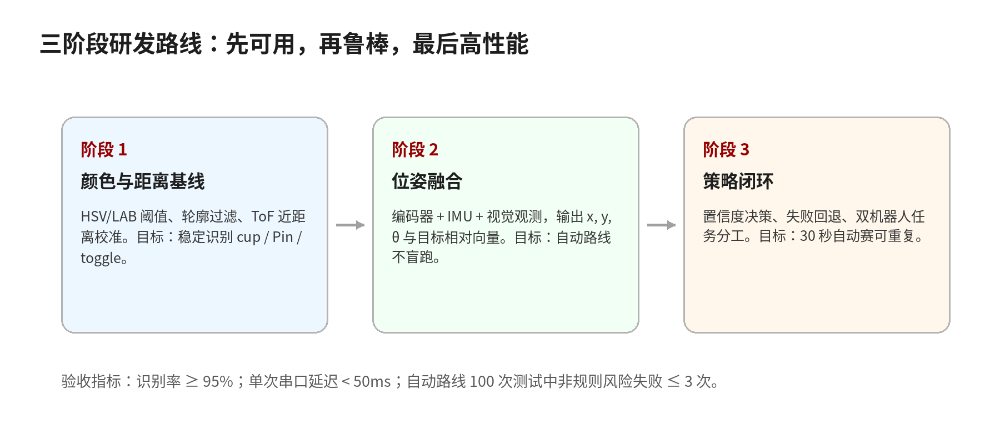
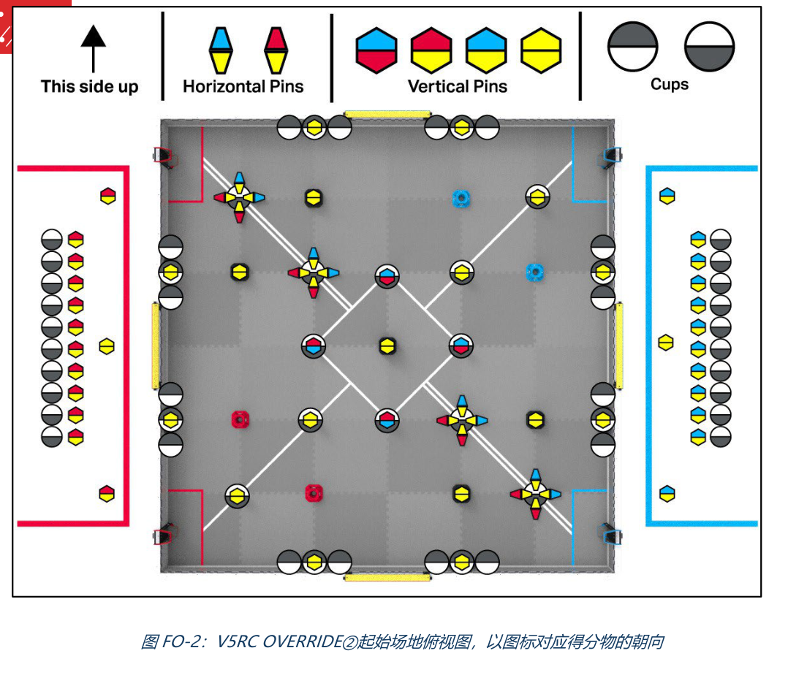

# VEX U 第三方传感器项目：技术栈与算法路线

发布人：SHELL
发布时间：2026年5月24日

<!-- truncate -->

---

## 1. 项目定位：不是“堆传感器”，而是做感知闭环



*图 1：OVERRIDE 场地俯视图。该图用于说明感知系统需要识别的主要场地目标：Goal、Toggle、导入筒、边界线与中场区域。*


OVERRIDE 赛季的场地元素很适合做环境感知：Pin、Cup、Goal、Toggle、中场区域、导入桶和边界线都有明确颜色或几何特征。VEX U 又把自动赛时段扩展到 30 秒，并允许每支队伍一局使用两台机器人，所以“自动阶段是否稳定”会直接变成胜负差距。

但这个项目不能理解为把树莓派、摄像头、ToF、IMU 全塞上车。真正有效的方案应是：**V5 Brain 做实时控制，外部嵌入式系统做感知计算，传感器只提供可解释数据，策略层根据置信度决定是否行动。** 目标不是展示 AI，而是在比赛环境中提高自动路线成功率、目标对准精度、夹取确认能力和碰撞后的恢复能力。

---

## 2. 规则边界：推荐的合规链路



*图 2：VEX U 规则中关于传感器、附加电子元件与外部处理器的关键限制。工程设计应围绕“感知/信号处理可以扩展，执行控制必须回到 V5 Brain”展开。*


上传规则中，VEX U 允许“附加电子元件”和“外部处理器”。附加电子元件包括非 VEX 销售的传感器、处理器或自制电子设备；外部处理器指在把传感器数据发送给 V5 Brain 前独立处理数据的计算设备。

关键是 `<VUR12>`：用于机器人感应和信号处理的传感器与附加电子元件没有数量限制，但必须通过 V5 Brain 外置端口连接；不能直接与 VEX 电机或电磁阀发生电气作用；可以使用一个低于 13V 的额外锂电、磷酸铁锂或镍氢电池组为传感器/处理器供电；V5 Brain 本身仍只能由 V5 电池供电。

因此，推荐架构是：

```text
第三方传感器 → 外部处理器 → V5 Brain → VEX 电机 / VEX 气动 / VEX 合规机构
```

不要让外部处理器直接驱动非 VEX 执行器，也不要购买带复杂机械结构和驱动器的市售机电总成。`<VUR13>` 对商用机电组件有限制，尤其要注意“商用里程计总成”这类边缘件。更稳的做法是：队员自制无源里程计轮和安装结构，再接入合规传感器或编码器。

---

## 3. 总体架构：三层系统



*图 3：推荐系统架构。V5 Brain 承担控制闭环与比赛模板，外部处理器承担视觉、深度、融合与目标识别。*




### 3.1 V5 控制层

V5 Brain 不适合跑复杂视觉，但适合做确定性控制。它应负责：比赛模板、底盘闭环、机构控制、状态机、路径跟踪、安全降级和外部数据验收。推荐使用 `PROS + C++`，因为它更适合组织多任务、串口通信、路径控制和比赛状态切换。

V5 端不要接收原始图像，只接收结构化数据，例如目标类型、相对坐标、距离、置信度、机器人位姿和传感器状态。这样可以降低通信压力，也能避免 V5 端承担不该承担的计算任务。

### 3.2 外部处理器层

外部处理器负责把原始传感器数据变成 V5 可用信息。入门可用 OpenMV，适合快速做颜色识别和目标对准；中阶可用 Raspberry Pi Zero 2 W，适合运行 OpenCV、日志记录和轻量模型；高阶可用 Raspberry Pi 5 / Compute Module 搭配 OAK-D Lite，实现深度视觉和边缘 AI。

外部处理器输出的数据包建议包含：`timestamp`、`pose_x`、`pose_y`、`theta`、`target_type`、`target_dx`、`target_dy`、`target_dist`、`confidence`、`status_bits`。实际通信不建议用 JSON，而应使用二进制帧：帧头、长度、序号、payload、CRC16。

### 3.3 传感器层

传感器选择要从任务出发，而不是只看参数。

| 任务 | 推荐硬件 | 作用 |
|---|---|---|
| 颜色目标识别 | OpenMV / Pi Camera | 识别 Pin、Cup、Toggle 颜色与轮廓 |
| 深度估计 | OAK-D Lite / VL53L5CX | 判断目标距离，减少“看见但抓不到” |
| 近距离确认 | ToF 阵列 / 单点 ToF | 检测夹爪入口、Goal 前方、障碍物 |
| 姿态估计 | BNO085 / VEX Inertial | heading lock、碰撞后姿态恢复 |
| 位移估计 | 自制无源里程计轮 + 编码器 | 提高自动路线重复性 |
| 绝对定位补偿 | VEX GPS / 视觉固定点 | 修正累计漂移 |

---

## 4. 推荐技术栈

### 4.1 入门栈：OpenMV + ToF + V5

适合快速验证。OpenMV 用 MicroPython 编写视觉程序，直接做 HSV 阈值、轮廓识别、目标中心点估计；VL53L5CX 或单点 ToF 用于确认前方距离；V5 端根据目标偏移做自动对准。

典型用途：一键对准 Toggle、识别最近黄色 Pin、辅助夹取、进料口检测。优点是开发快、调试直观、功耗低；缺点是算力有限，多目标和复杂遮挡场景下不够强。

### 4.2 中阶栈：Raspberry Pi Zero 2 W + OpenCV + PROS

适合进入完整工程化。Pi Zero 2 W 可以运行 Python / OpenCV，记录图像和识别结果，方便反复调参。建议使用 Raspberry Pi OS Lite、systemd 开机自启、OpenCV 处理图像、串口进程向 V5 发送二进制小包。

视觉分辨率不宜盲目拉高。320×240 或 640×480 通常更适合比赛：延迟低、处理稳定、对准够用。算法先采用传统视觉，不建议一开始就上大型神经网络。

### 4.3 高阶栈：OAK-D Lite + Raspberry Pi / CM4 / Pi 5

高阶方案适合做双目深度、目标空间坐标和边缘 AI。OAK-D Lite 可提供深度信息，适合判断 Pin/Cup/Goal 的距离和方位，也能在中场阶段辅助识别障碍物或对手机器人。

但它的工程成本明显更高：供电、电缆、启动时间、模型部署、支架刚性和散热都要处理。建议在机械结构、基础自动和通信稳定之后再上高阶视觉，否则很容易变成“传感器很强，整车不稳定”。

---

## 5. 通信与供电：隐藏的成败点

V5 Smart Port 的串口通信应按 RS485 通信思路处理，外部处理器侧需要合适的电平/RS485 转换，不建议直接把树莓派 GPIO 接到 Smart Port。V5 端要有 watchdog：如果 100-200ms 没收到有效数据包，就停止使用视觉修正，只执行本地里程计或安全停车。

推荐数据帧：

```text
0xAA 0x55 | length | seq | timestamp | payload | crc16
```

供电方面，外部电子系统应统一由一个低于 13V 的额外电池进入稳压模块，再给 Pi、OpenMV、OAK-D、ToF 等设备供电。必须保证线缆应力释放，避免被机构拉断；必须设计开机自检，显示电压、温度、帧率、通信状态。比赛中最常见的问题不是算法错误，而是处理器没启动、USB 摄像头掉线、供电跌落或线缆瞬断。

---

## 6. 算法路线：从可解释视觉开始



*图 4：算法路线图。建议先完成稳定通信和传统视觉，再逐步加入深度估计、位姿融合和 Driver Assist。*


### 6.1 颜色分割与几何过滤

第一阶段不建议直接上 AI。OVERRIDE 目标物颜色明显，先用 HSV / LAB 阈值就能解决大量问题。流程如下：

```text
摄像头帧 → 曝光/白平衡控制 → HSV 转换 → 颜色阈值 → 形态学处理 → 轮廓提取 → 几何过滤 → 目标候选
```

只看颜色会误识别队牌、装饰件和场地边缘，所以必须加入几何过滤：面积范围、长宽比、圆度/矩形度、图像位置约束、目标连续性。比如 Pin、Cup、Toggle 的投影形状不同，不能只用“黄色像素很多”来判断目标。

### 6.2 多目标跟踪与置信度

比赛中目标会被遮挡、反光或短暂丢失，因此单帧识别不可靠。建议使用轻量 Kalman Filter 或 SORT-lite 思路：给每个目标分配 ID，预测下一帧位置，用距离门限和类别一致性做匹配。每个目标都要有置信度。

策略层应按置信度分级：

| 置信度 | 行为 |
|---|---|
| > 0.75 | 允许自动对准、靠近、夹取 |
| 0.45-0.75 | 只允许减速修正，不允许机构动作 |
| < 0.45 | 忽略视觉目标，回退预设路线 |

这个机制比识别算法本身更重要，因为它决定机器人什么时候应该相信传感器。

### 6.3 深度估计与坐标转换

要完成夹取或放置，机器人必须知道目标距离。距离可以来自三种方式：单目几何估计、ToF 测距、双目深度。单目便宜但受角度影响；ToF 稳定但分辨率低；OAK-D 能提供更完整深度，但系统复杂。

基本坐标链路：

```text
像素坐标 (u, v)
→ 相机坐标
→ 机器人坐标 (x_r, y_r)
→ 场地坐标 (x_f, y_f)
```

这里必须做相机标定：镜头内参、安装高度、俯仰角、相机相对机器人中心的偏移。支架如果会晃，算法再好也会漂。

### 6.4 位姿融合

自动路线不能只靠驱动轮编码器，因为轮子会打滑。也不能只靠视觉，因为视觉会遮挡。推荐融合：驱动编码器或无源里程计负责位移，IMU 负责 heading，视觉或 GPS 负责绝对修正。

简化 EKF 或互补滤波即可：

```text
预测：编码器 + IMU 积分得到新位姿
校正：识别到可信 Goal / Toggle / 场地固定点时修正位姿
降级：视觉失效时只用本地里程计
恢复：碰撞后寻找固定目标重新定位
```

VEX 场地固定、比赛时间短，不需要复杂 SLAM。更现实的是“已知地图 + 局部视觉修正”。

### 6.5 策略状态机

最终算法要落到比赛动作。建议 V5 端使用有限状态机：

```text
INIT → LOCALIZE → SEEK_TARGET → APPROACH → ALIGN → INTAKE/PLACE → VERIFY → NEXT_TASK → FAILSAFE
```

每个状态都要有退出条件和超时条件。例如：`ALIGN` 阶段要求 heading error 小于 3°、横向误差小于 3cm 才允许机构动作；`VERIFY` 阶段用 ToF 或电机电流判断是否夹到目标；如果超时或置信度下降，就进入 `FAILSAFE`，而不是原地死等。

---

## 7. Driver Assist：手动阶段也能收益

第三方传感器不只服务自动赛。手动阶段可以做辅助功能：一键对准 Goal、自动对齐 Toggle、夹取确认、防撞减速、heading lock、进料口检测。VEX U 两台机器人同时工作，Driver Assist 可以减少操作手负担，让驾驶员从重复微调中解放出来。

但辅助功能必须保守。驾驶员给出意图，V5 做小范围修正；不要让外部处理器绕过 V5 控制链路，也不要让机器人在低置信度下自动执行危险动作。

---

## 8. 测试路线：用数据证明可行



*图 5：OVERRIDE 起始场地布局。自动路线测试应围绕起始目标分布、目标遮挡和跨区域风险建立测试矩阵。*


建议从第一天记录数据：图像帧、识别结果、目标坐标、V5 位姿、控制命令、通信延迟和失败原因。核心指标包括：识别准确率、误检率、距离误差、端到端延迟、串口丢包率、自动路线成功率、碰撞恢复率。

测试矩阵可以这样安排：

| 场景 | 目的 |
|---|---|
| 正常光照 | 建立基线 |
| 暗光 / 强反光 | 测阈值鲁棒性 |
| 目标遮挡 | 测跟踪与置信度 |
| 机器人震动 | 测支架刚性和滤波 |
| 通信中断 0.2s | 测 watchdog |
| 连续自动 50 次 | 测工程稳定性 |
| 对手机器人经过 | 测误检和避障 |

判断项目是否成熟，不看“最好一次跑得多好”，而看连续 30-50 次中失败率能不能压下来。

---

## 9. 推荐开发顺序

1. **合规与通信**：完成供电、RS485/串口、CRC、watchdog、V5 状态显示。  
2. **单目标识别**：先识别黄色 Pin 或 Toggle，输出角度和置信度。  
3. **自动对准闭环**：V5 根据目标偏移做 heading / lateral correction。  
4. **距离确认**：加入 ToF 或深度视觉，完成抓取/放置验证。  
5. **位姿融合**：编码器 + IMU + 视觉固定点，修正自动路线漂移。  
6. **Driver Assist**：把可靠功能迁移到手动阶段。  
7. **双机器人分工**：一台偏 stack / goal，另一台偏 toggle / 中场控制。

最终结论：该项目可行，但应按工程系统推进。先做稳定通信和可解释视觉，再做融合定位，最后再考虑 AI 模型。VEX U 的第三方传感器真正价值不在“看见更多”，而在“看见后能判断、能行动、能失败恢复”。

---

## 来源与参考

### 规则来源

1. `V5RC 26-27 OVERRIDE-0.1 CN.pdf`。重点参考：第 18 页 OVERRIDE 基本赛局与 VEX U 自动期说明；第 25 页 GDC 关于传感器、光照变化和传感器干扰公平性的说明；第 89 页 VEX U 定义；第 93 页 `<VUT1>` 与 `<VUT4>`；第 100 页 `<VUR12>` 与 `<VUR13>`。

### 技术资料来源

2. VEX Library：V5 Robot Brain 规格、Smart Ports、3-Wire Ports。https://kb.vex.com/hc/en-us/articles/360060662352-Understanding-the-V5-Robot-Brain  
3. PROS for V5：Generic Serial API。https://pros.cs.purdue.edu/v5/pros-4/group__c-serial.html  
4. OpenMV 官方资料。https://openmv.io/  
5. Raspberry Pi Zero 2 W 官方资料。https://www.raspberrypi.com/products/raspberry-pi-zero-2-w/  
6. Luxonis OAK-D Lite 官方资料。https://shop.luxonis.com/products/oak-d-lite-1  
7. ST VL53L5CX 官方资料。https://www.st.com/en/imaging-and-photonics-solutions/vl53l5cx.html  
8. CEVA BNO08X Datasheet。https://www.ceva-ip.com/wp-content/uploads/BNO080_085-Datasheet.pdf  
9. WPILib：HSV thresholding 与视觉处理思路。https://docs.wpilib.org/en/stable/docs/software/vision-processing/wpilibpi/image-thresholding.html
