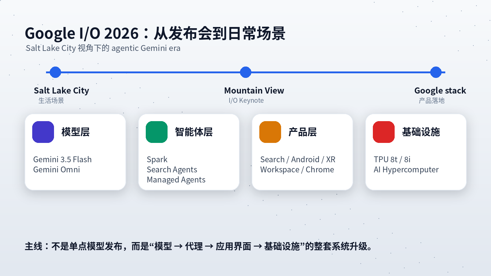
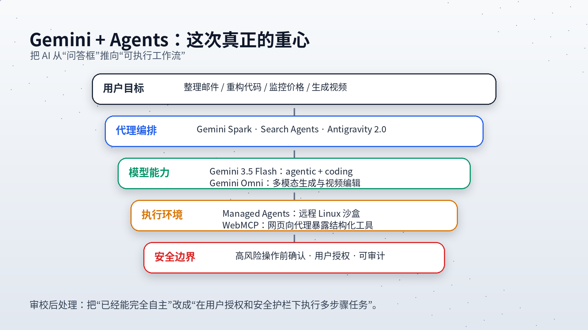
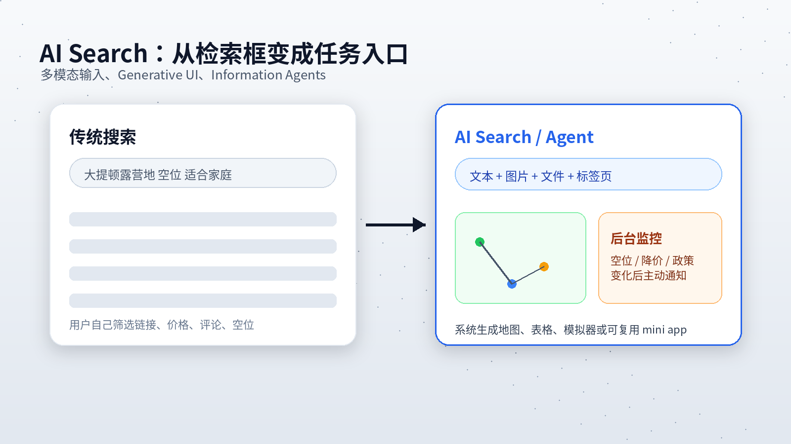
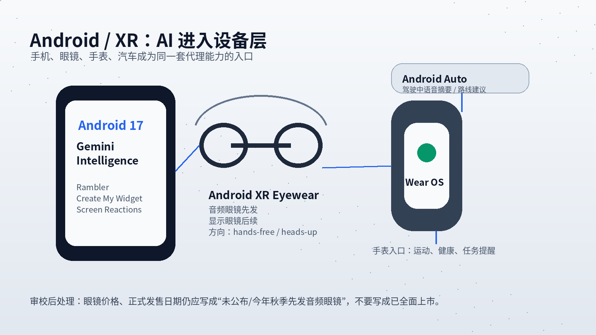
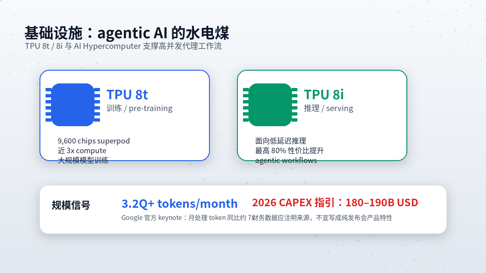

# 从盐湖城看山景城：一个华裔技术宅眼中的 Google I/O 2026

作者：Alex
发布时间：2025年5月25日

## 写在前面

盐湖城的五月，雪终于化干净了。我坐在 Sugar House 社区的一家咖啡馆里，窗外是 Wasatch 山脉还没有完全褪去白顶的轮廓，手边是一杯偏苦的本地烘焙，屏幕上播放的是 Google I/O 2026 的重播。和盐湖城晴朗干燥的空气比起来，山景城 Shoreline Amphitheatre 里的灯光、演示和产品叙事，像是另一个世界发生的事。

我是 Alex，一名生活在盐湖城的华裔软件工程师。在这个摩门教文化深厚、户外运动狂热、但科技氛围也在悄悄生长的城市里，我对技术有一种 Salt Lake Valley 式的实用主义态度：可以兴奋，但必须先问一句——这东西在真实生活里到底有没有用？

今年的 Google I/O，我不再以单纯技术爱好者的身份观看，而是尝试把那些发布内容放回自己的日常：早晨从 Cottonwood Heights 出发去市中心办公室，中午在 City Creek Center 附近找吃的，下午到 Sugar House Park 跑一圈，晚上回家陪家人。在这套生活流里，Google 发布的东西哪些会真正参与进来，哪些还只是 demo？

这篇文章不是新闻汇总，而是一次开发者视角的筛选：我只讨论那些可能改变日常工作流、移动设备交互、搜索方式和软件开发方式的部分。

## 一、Gemini 3.5：这次的重点不是“更会聊天”，而是“更会执行”

I/O 2026 最核心的信号可以概括为一句话：Google 正在把 Gemini 从一个回答问题的模型，推进为一套面向任务执行的代理基础设施。

Gemini 3.5 Flash 是这条路线的中心。官方公布的数据里，它在 Terminal-Bench 2.1、GDPval-AA、MCP Atlas 等编程和 agentic benchmark 上超过了上一代 Gemini 3.1 Pro；Google 也把它定位为适合长周期、多步骤任务的 Flash 级模型。换句话说，这次升级的关键不是“回答更像人”，而是它能不能在较低延迟和较低成本下，持续规划、调用工具、修改代码、检查结果，再继续迭代。

对开发者来说，这比单纯的语言能力更重要。因为软件工作里最耗时的部分，往往不是“知道答案”，而是反复处理一堆上下文：项目结构、依赖、测试失败、代码风格、需求变更、日志信息。一个足够快、足够便宜、又能进入工具链的模型，才可能真正改变工作方式。

## 二、Gemini Omni：多模态不再只是输入，而是输出也开始统一

和 3.5 Flash 同时值得关注的是 Gemini Omni。Google 对它的定义很直接：从任意输入生成任意输出，第一阶段先从视频开始。Omni Flash 已经进入 Gemini app、Google Flow 和 YouTube Shorts 相关创作场景。

这不是“给一段文字生成视频”这么简单。更关键的是它支持把图片、视频、文本等参考材料融合进同一个生成过程，并通过自然语言连续编辑视频：改变背景、调整动作、加入物体、保持角色一致性、改善物理表现。对内容创作者和产品团队来说，这意味着原本需要剪辑、配音、后期和动效协作的部分流程，有机会变成一个可迭代的对话过程。

我立刻想到一个很工程化的场景：录一段软件操作，然后让 Omni 帮我生成带标注、带转场、带旁白的技术演示视频。这里真正有价值的不是“炫酷”，而是把演示材料的制作成本压低。一个工程师如果能更低成本地解释自己的系统，就能减少沟通损耗。

## 三、Agentic AI：AI 开始从应用里走出来

如果说过去两年我们讨论的是 AI 能回答什么问题，那么 I/O 2026 讨论的是 AI 能在你授权后做什么事情。

### Gemini Spark：后台运行的个人代理

Gemini Spark 是这次非常关键的产品。官方说法是：它是一个 24/7 personal AI agent，可以在手机或电脑关闭时继续在后台工作，并在用户方向控制下采取行动。这里要注意措辞：它不是一个“完全不需要人管的数字替身”，而是一个需要用户启用、授权，并在重要操作前确认的代理。

我认为 Spark 的真实价值可能在三个方向：

第一，订阅和账单管理。它可以帮你持续整理账单、提醒异常订阅、归类费用。第二，家庭和学校信息整合。学校通知、日历、家长邮件这些内容很碎，适合被整理成任务列表。第三，会议和项目上下文整理。很多讨论散落在 Gmail、Docs、Calendar 和聊天记录里，AI 代理如果能跨应用汇总，价值会比单一聊天框高很多。

但信任是 Spark 最大的门槛。只要涉及账单、邮件、日历、支付、对外发送信息，系统必须明确区分“整理建议”和“实际执行”。Google 目前也把 Spark 放在相对谨慎的测试和订阅者 beta 路线中，这个节奏是合理的。

### Search Agents：搜索从“你问它答”变成“它替你守候”

Google 把 Search box 称为 25 年来最大的一次升级。新的搜索入口支持文本、图片、文件、视频和 Chrome 标签页作为输入，并能够用 Gemini 3.5 Flash 与 Antigravity 生成更适合问题的界面，例如表格、图表、模拟器或 mini app。

更重要的是 Information Agents。传统搜索是你主动查一次，然后自己筛选。信息代理则是你设定条件，它在后台持续监控变化，再给你合成更新。

这在日常生活里非常实用。比如我想知道“大提顿国家公园某个营地是否释放空位”，或者“盐湖城到旧金山的往返机票是否降到 200 美元以下”。过去我必须反复查；现在的方向是：把条件交给搜索代理，让它替我守候。

这里的关键变化是，搜索从信息检索系统变成了任务入口。Google 不只是想返回网页，而是想成为你启动、监控和完成任务的层。

## 四、Android、XR 与车载：AI 进入设备层

Android 17 与相关 Android 生态更新展示了一种趋势：Gemini 不再只是一个 App，而是开始成为设备交互层的一部分。Rambler、Create My Widget、Screen Reactions、Pause Point、iPhone 到 Android 迁移改进等功能，各自看起来并不宏大，但它们都在把 AI 放进更细的交互节点里。

Rambler 的价值在输入层：语音输入时自动清理口头禅、整理语句、多语种混输，对中英夹杂的用户很有用。Create My Widget 的价值在桌面层：用户不再只从预设组件中选择，而是用自然语言生成适合自己的信息面板。Screen Reactions 是创作者工具，降低录屏加前置摄像头反应视频的门槛。Pause Point 则是数字健康方向的功能，给娱乐类分心应用增加一点阻力。

Android XR 智能眼镜是硬件层最值得观察的部分。Google 官方确认有两类眼镜：音频眼镜和显示眼镜。音频眼镜先在今年秋季推出，合作方包括 Samsung、Gentle Monster 和 Warby Parker；显示眼镜会把导航、翻译、提醒等内容投射到视野里。

我对这个品类既兴奋又谨慎。兴奋在于盐湖城的生活场景确实适合它：徒步时识别山峰、骑车时获得导航、旅行时做实时翻译、家庭出游时快速拍照。谨慎在于眼镜涉及摄像头、麦克风、位置和个人上下文，隐私边界比手机更敏感。价格、续航、佩戴舒适度、录制提示、数据处理方式，都会决定它是日常设备还是又一个 demo 设备。

## 五、AI Coding：程序员的工作方式正在被重写

开发者部分可能是 I/O 2026 最务实的一块。

Antigravity 2.0 从编码环境扩展成 agent-first development platform。它不只是让模型补全代码，而是让多个代理并行处理任务：一个写代码，一个生成素材，一个跑测试，一个检查问题。Google 同时给出了桌面应用、CLI 和 SDK 路线，让代理既可以进入个人工作流，也可以部署到企业基础设施里。

Managed Agents in the Gemini API 也很关键。过去搭建一个真正能执行任务的 AI agent，需要处理沙盒、工具调用、权限、文件系统、浏览器、持久状态等基础设施。现在 Google 的方向是：一次 API 调用就能 provision 一个远程 Linux 环境，让 agent 在隔离沙盒里推理、调用工具、执行代码、处理文件、浏览网页。对很多产品团队来说，这会显著降低 agent 产品化门槛。

WebMCP 则是网页层的基础协议尝试。它允许网页把 JavaScript functions、HTML forms 等能力以结构化工具的方式暴露给浏览器内的 AI agent。这个方向很重要，因为未来网页不能只给人看，还要告诉代理：“我能做什么、怎么调用、调用后返回什么”。这会改变网站设计的底层逻辑。

## 六、Workspace 与 Chrome：日常生产力的低噪声升级

Gmail 的 AI Inbox、AI 概览、草稿生成和任务识别，本质上是在把收件箱从“待阅读队列”改造成“待执行队列”。这方向是对的，因为邮件真正的问题不是信息太多，而是信息里的行动项分散、优先级不清。

Chrome 的变化则更偏开发者和执行端。Gemini in Chrome、Chrome DevTools for agents、WebMCP、Modern Web Guidance 这些能力组合起来，意味着浏览器开始成为 AI agent 的执行终端。过去 agent 操作网页主要靠看 DOM、点按钮、模拟人类；未来更理想的方式是网页直接暴露结构化工具，agent 通过可验证接口完成任务。

这对前端开发者有两个影响：一是要考虑“人类界面”和“代理接口”并存；二是调试、性能、无障碍、表单流程这些传统工程质量指标，会被 AI coding agent 自动检查和修复，前提是项目提供足够清晰的结构。

## 七、基础设施：AI 时代的水电煤

如果只看上层应用，I/O 2026 很容易被理解成一场模型和产品发布会。但从底层看，它更像是 Google 把 AI 产业链的每一层都展示了一遍：模型、应用、代理、浏览器、开发工具、云平台、TPU 和订阅商业模式。

Google Cloud 的第八代 TPU 分为 TPU 8t 和 TPU 8i。TPU 8t 面向大规模训练和高吞吐场景；TPU 8i 面向推理、强化学习和低延迟服务场景。这个分化很有意义，因为 agentic AI 的负载不再是单次问答，而是反复规划、调用工具、采样、验证、再执行。训练和推理的瓶颈不同，芯片系统也必须分化。

Google 还披露了 AI 使用规模：月处理 token 从 2024 年的 9.7 万亿，增长到 2026 年超过 3.2 千万亿。这个数字不只是宣传，它说明 AI 已经从实验功能变成高频基础设施。与此同时，Alphabet 2026 年资本支出指引达到 1800 亿到 1900 亿美元区间，这说明大模型竞争已经进入高投入阶段。

这也是为什么 AI 订阅计划变得重要。Google 新增每月 100 美元的 AI Ultra 档位，同时把原顶级 Ultra 从 250 美元降到 200 美元。对普通用户来说，这意味着 AI 功能会越来越像云存储、视频会员和开发者工具一样，被纳入长期订阅预算。对重度用户来说，问题不再是“要不要用 AI”，而是“为多高的算力额度付费才合理”。

## 结语：

 Salt Lake Valley 的清晨。雾气从大盐湖方向升起，阳光刚刚照亮 Wasatch 山脉。我出门时戴上耳机，Gemini 的每日简报已经把今天的日程、邮件和待办整理好。前一天设置的搜索代理继续监控大提顿国家公园的营地空位；Spark 还没有替我付款，但已经把可能需要我确认的事项列出来。

开车去市中心的路上，Android Auto 根据日历里的目的地建议路线。下午在 Sugar House Park 跑步时，手表提醒我某个营地释放了空位。我确认后继续跑，不需要打开一堆 App。

这才是 I/O 2026 真正描绘的未来：AI 不一定以一个巨大的聊天窗口出现，而是分散在搜索、手机、眼镜、手表、汽车、浏览器和开发工具里。它不再总是站在聚光灯下，而是在每一个自然的瞬间，替你挡掉一部分琐碎流程。

但这也带来新的问题：你愿意让多少个人数据进入代理系统？你愿意把多少执行权交给它？你愿意为多少 AI 算力长期付费？

技术的答案已经开始成形。真正的答案，会在日常生活里慢慢显现。

## 参考来源

- Google 官方 I/O 2026 汇总：https://blog.google/innovation-and-ai/technology/ai/google-io-2026-all-our-announcements/
- Sundar Pichai I/O 2026 keynote edited transcript：https://blog.google/innovation-and-ai/sundar-pichai-io-2026/
- Gemini Omni 官方介绍：https://blog.google/innovation-and-ai/models-and-research/gemini-models/gemini-omni/
- Android XR intelligent eyewear 官方介绍：https://blog.google/products-and-platforms/platforms/android/android-xr-io-2026/
- Google I/O 2026 Developer keynote：https://developers.googleblog.com/all-the-news-from-the-google-io-2026-developer-keynote/
- Managed Agents in the Gemini API：https://blog.google/innovation-and-ai/technology/developers-tools/managed-agents-gemini-api/
- Google AI subscriptions：https://blog.google/products-and-platforms/products/google-one/google-ai-subscriptions/
- TPU 8t / 8i technical deep dive：https://cloud.google.com/blog/products/compute/tpu-8t-and-tpu-8i-technical-deep-dive
- Google Cloud AI infrastructure at Next '26：https://cloud.google.com/blog/products/compute/ai-infrastructure-at-next26
